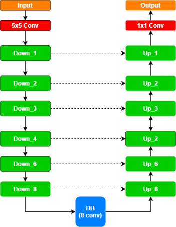
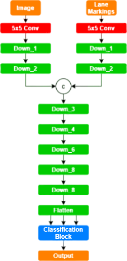

# EL-GAN
This repository offers an implementation for the Embedded loss GAN. The network was introduced in the paper [EL-GAN: Embedding Loss Driven Generative
Adversarial Networks for Lane Detection](https://arxiv.org/pdf/1806.05525) by Mohsen Ghafoorian, Cedric Nugteren, Nora Baka, Olaf Booij, Michael Hofmann.
## How to use
After downloading the code from this repository you can download the third party dependencies from requirements.txt.
## Introduction
The model introduced relied heavily on the Denseblocks which were used in  both the generator and the discriminator, it also introduced a novel approach to the discriminator, where the loss was caculated as a distance between the embeddings of the fake labels (labels produced by the generator), and the real labels (ground truth). They called this loss the embedding loss, they also passed not only the labels to the discriminator, but also the original images the labels respond to, creating a discriminator with "two heads".
<b>Note:</b> Labels in the above paragraph and later on refers to the 2-channel image containing the lane markings.

## Generator
The generator in the model was a FC-DenseNet (fully connected dense network), which was introdued in [this](https://openaccess.thecvf.com/content_cvpr_2017_workshops/w13/papers/Jegou_The_One_Hundred_CVPR_2017_paper.pdf) paper. The architecture of the generator could be seen in the image below.

  

The downwards path is created by connecting Down_n blocks and Up_n blocks, a donwn (up) block is a dense block with n denselayers and a tranistion down (up) blocks. There architecure can be found in the [original repository](https://github.com/baldassarreFe/pytorch-densenet-tiramisu) by Fredrico Baldassarre. As seen in the image above the layers in the down path are [1, 2, 3, 4, 5, 6, 8] layers blocks, there an 8 layers block in the middle, and [8, 6, 5, 4, 3, 2, 1] layers blocks in the up path.
## Discriminator
The discriminator in EL-GAN (as mentioned before) has two heads, they take in the original images and the labels 

  

The two head converge after 2 dense blocks, where there output is concatenated and continues through 5 more dense blocks. The embedding is the output of the last dense block (the 1x1 conv and the classification layer are there more for symmetry than anything else, they aren't necessary in the network.

## Thanks
The repository was built on top of this [repository](https://github.com/baldassarreFe/pytorch-densenet-tiramisu) owned by Federico Baldassarre - the referenced repository offered an implementation for FCDenseNets and DenseNets. I would like to thank the author, whose repository not only helped me for the implementation and getting a better understanding for DenseNets, but also with organizing and presenting a project on GitHub. 
I would also like to thank the author's of EL-GAN, especially Mr. Ghafoorian for answering an enquiry I had on email, in addition to the authors of ["The One Hundred Layers Tiramisu: Fully Convolutional DenseNets for Semantic Segmentation"](https://arxiv.org/abs/1611.09326) and ["Densely Connected Convolutional Networks"](https://arxiv.org/abs/1608.06993), these people are innovating in research, and by sharing their work, helping people like me to get to know and work in the field (even if I barely scratch the surface). 
The images for the architecture were created using [app.diagrams.net](https://app.diagrams.net/).
